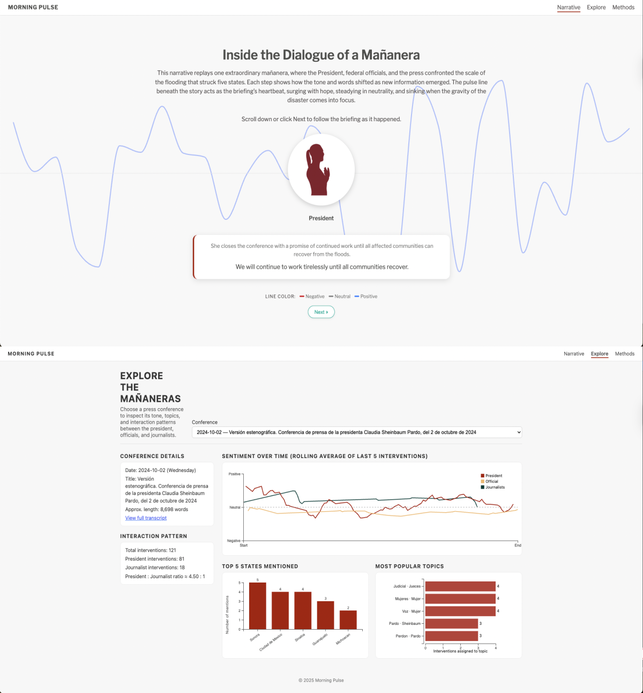

# Morning Pulse

José Manuel Cardona Arias

## Description

Morning Pulse is an interactive data-journalism project that analyzes how dialogue unfolds inside Mexico’s daily Conferencias Mañaneras. The website features two complementary components:

1. Narrative Tab — A Scrollytelling Reconstruction

A detailed, moment-by-moment narrative of one extraordinary morning press conference devoted entirely to the 2024 flood crisis affecting Veracruz, Puebla, Hidalgo, Querétaro, and San Luis Potosí.
As users scroll, the page animates:

- Speaker silhouettes (President, officials, journalists)
- Contextual storytelling
- Original quotes
- An evolving sentiment pulse line that visualizes the emotional tone of each intervention

The goal is to translate a dense government transcript into a clear, emotionally legible narrative.

2. Explore Tab — Interactive Data Visualization

A set of analytical tools that allow users to explore:

- Who speaks the most across all mañaneras
- How sentiment shifts across time and speaker types
- Topic prevalence (security, welfare, corruption, migration, etc.)
- Geographic mentions by region
- Differences between officials and journalists

These visualizations give readers an accessible way to study communication patterns in presidential press conferences.

3. Methods Tab — How the Project Was Built

## Preview

## Data Sources

All transcript data was collected from:

Gobierno de México — Presidencia
Transcripciones de las Conferencias de Prensa Matutinas
https://www.gob.mx/presidencia/es/archivo/articulo?idiom=es&tag=conferencia-de-prensa

Sentiment analysis model:
Pérez, Juan Manuel, et al. pysentimiento: A Python Toolkit for Opinion Mining and Social NLP Tasks. arXiv:2106.09462 (2023).

Geographic and topic classifications were derived through manual keyword dictionaries and programmatic parsing of the official transcript text.