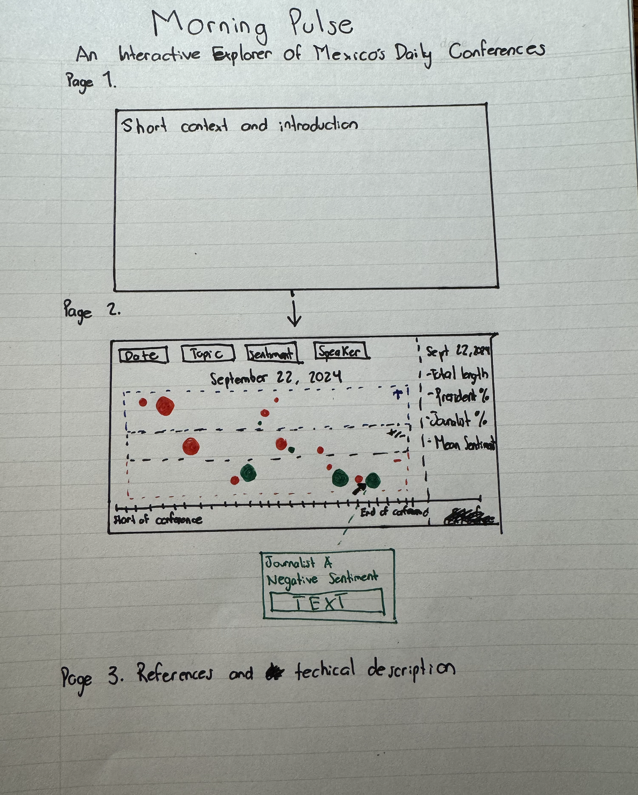

# José Manuel Cardona Arias

## Description

My static visualization project called "Morning Voices" analyzed more than a year of the Mañaneras showing how:
- The President dominates speaking time (5 to 8 more interventions)
- Journalists' questions concentrate on specific topics
- Sentiment shifts dinamically and it depends on the topics discussed.

My next step is to make these dynamics interactive, allowing users to explore each session, zoom into specific conversations, and visualize how tone, topic, and speaker dominance evolve in real time. My goal is to create an interactive conversation explorer where users can navigate across daily conferences and visualize the interplay between who speaks, what they say and how they say it. 

## Technical Plan re: Option A/B/C/D

My technical plan is not 100% clear right now. I intend to use a D3-based timeline visualization that displays all interventions in a given conference as color-coded and sentiment-coded nodes arranged chronically. The interactive part is that users will be able to:

- Move through different conference dates.
- Filter interventions by speaker type, topic, or sentiment.
- Hover to see text excerpts and metadata (date, word count, sentiment score).
- Watch transitions that illustrate changes in conversational tone and balance. 

Right now, a very simple schema of my datafranme is:

- date: Conference date
- intervention_order: Sequence in conversation
- speaker: Name of speaker
- role: President/Official or Journalist
- topic: One of 8 policy areas (e.g. Security, Education, Corruption)
- sentiment: Numeric score from –1 to +1 (via pysentimiento)
- text: intervention text
- word_count: Number of words spoken
- state_mentions: List of Mexican states referenced (if any)

### Potential visual design

- Main visualization: conversation timeline
  - Horizontal axis: order of intervention
  - Vertical axis: three areas (pink=negative, gray=neutral, blue=positive)
  - Each dot:
    - Size: word count
    - Color: speaker type (red=president, green=journalists, yellow=other officials)
  - Hover:
    - Tooltip with speaker name, topic, sentiment score, and text sample.
  - Click: Expands a sidebar panel showing the full text and sentiment scores.
- Filters and controls: Top control panel
  - Date selector: choose any conference (Calendar widget)
  - Topic filter: Checkbox menu
  - Sentiment slider: adjust visible range (for example, only negative interventions)
  - Speaker toggle: Show/hide President, Journalists, Others
- Conference metadata: a vertical column besides the visualization displays summary metrics for the selected conference
  - % of total words spoken by speaker type
  - Mean sentiment score
  - Dominant topic
  - Total length

## Mockup

## Data Sources

### Data Source 1: [Blog de la Presidencia de la República](https://www.gob.mx/presidencia/es/archivo/articulos?filter_origin=archive&idiom=es&order=DESC&page=1)

## Questions

1. Given the project’s requirements, do you think a single interactive visualization built in D3 is an appropriate level of complexity?
2. Is having multiple speaker roles and sentiment zones on one main timeline manageable in D3, or should I simplify the visualization first?
3. Does it make sense to include all filters (date, topic, sentiment, speaker) from the start, or should I prioritize the most relevant ones? Maybe just date?
4. Are there known performance issues I should expect when loading a JSON dataset of ~10–15k interventions?
5. Would the interactive elements (tooltips, filters, speaker toggles, and dynamic updates) meet the criteria for ‘non-trivial interactivity’?
6. My dataset is preprocessed in Python and exported as JSON. Is that the preferred format for D3, or should I consider CSV for efficiency?
7. Does splitting the y-axis into Positive / Neutral / Negative sentiment regions communicate the idea effectively?
8. Would it make sense to include a subtle animation to show the flow of sentiment over time (i.e., pulses along the timeline)?